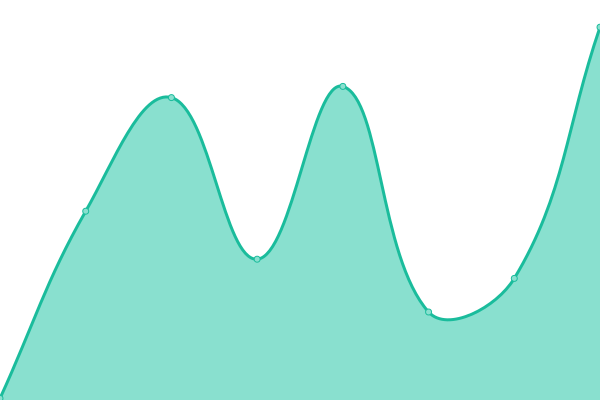
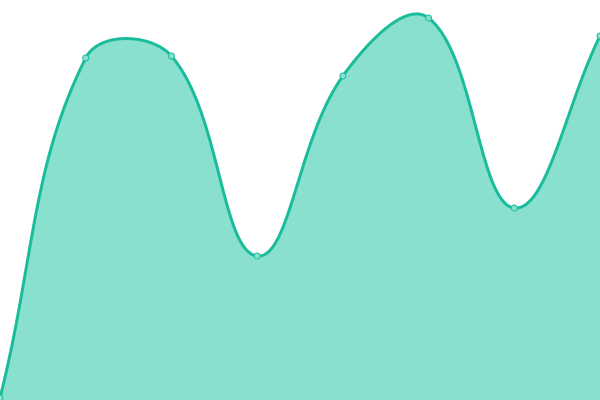

# [📈 Live Status](https://demo.upptime.js.org): <!--live status--> **🟩 All systems operational**

This repository contains the open-source uptime monitor and status page for [Rodrigo Santomauro](www.linkedin.com/in/rsantomauro), powered by [Upptime](https://github.com/upptime/upptime).

With [Upptime](https://upptime.js.org), you can get your own unlimited and free uptime monitor and status page, powered entirely by a GitHub repository. We use [Issues](https://github.com/rsantomauro/uptime/issues) as incident reports, [Actions](https://github.com/rsantomauro/uptime/actions) as uptime monitors, and [Pages](https://demo.upptime.js.org) for the status page.

<!--start: status pages-->
<!-- This summary is generated by Upptime (https://github.com/upptime/upptime) -->
<!-- Do not edit this manually, your changes will be overwritten -->
<!-- prettier-ignore -->
| URL | Status | History | Response Time | Uptime |
| --- | ------ | ------- | ------------- | ------ |
|  [Google](https://www.google.com) | 🟩 Up | [google.yml](https://github.com/rsantomauro/uptime/commits/HEAD/history/google.yml) | 

 96ms
     
 | 

<a href="https://rsantomauro.github.io/uptime/history/google">100.00%</a>
    

|  [Wikipedia](https://en.wikipedia.org) | 🟩 Up | [wikipedia.yml](https://github.com/rsantomauro/uptime/commits/HEAD/history/wikipedia.yml) | 

 149ms
     
 | 

<a href="https://rsantomauro.github.io/uptime/history/wikipedia">100.00%</a>
    

|  [GitHub](https://github.com) | 🟩 Up | [git-hub.yml](https://github.com/rsantomauro/uptime/commits/HEAD/history/git-hub.yml) | 

 201ms
     
 | 

<a href="https://rsantomauro.github.io/uptime/history/git-hub">99.77%</a>
    

|  [Tienda Inglesa](https://www.tiendainglesa.com.uy) | 🟩 Up | [tienda-inglesa.yml](https://github.com/rsantomauro/uptime/commits/HEAD/history/tienda-inglesa.yml) | 

 899ms
     
 | 

<a href="https://rsantomauro.github.io/uptime/history/tienda-inglesa">100.00%</a>
    

|  [Antel](https://pagos.antel.com.uy/epagos-w2w-comercio-web/jsf/error.xhtml) | 🟩 Up | [antel.yml](https://github.com/rsantomauro/uptime/commits/HEAD/history/antel.yml) | 

 1480ms
     
 | 

<a href="https://rsantomauro.github.io/uptime/history/antel">100.00%</a>
    

|  [Ubersuggest](https://app.neilpatel.com/en/login) | 🟩 Up | [ubersuggest.yml](https://github.com/rsantomauro/uptime/commits/HEAD/history/ubersuggest.yml) | 

 247ms
     
 | 

<a href="https://rsantomauro.github.io/uptime/history/ubersuggest">100.00%</a>
    

|  [TiendaMia](https://tiendamia.cr) | 🟩 Up | [tienda-mia.yml](https://github.com/rsantomauro/uptime/commits/HEAD/history/tienda-mia.yml) | 

 453ms
     
 | 

<a href="https://rsantomauro.github.io/uptime/history/tienda-mia">100.00%</a>
    

<!--end: status pages-->

[**Visit our status website →**](https://demo.upptime.js.org)

## 📄 License

- Powered by: [Upptime](https://github.com/upptime/upptime)
- Code: [MIT](./LICENSE) © [Anand Chowdhary](https://anandchowdhary.com), supported by [Pabio](https://pabio.com)
- Data in the `./history` directory: [Open Database License](https://opendatacommons.org/licenses/odbl/1-0/)
